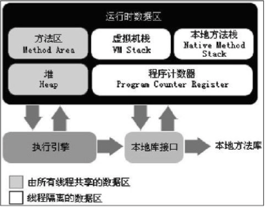

# Java运行时环境

## 内存管理机制

### 线程内的

* Program Counter Register：较小内存空间，作为当前线程所执行的字节码的信号指示器。字节码解释器工作时就是通过改变这个计数器的值来选取下一条需要执行的字节码指令，分支，循环，跳转，异常处理，线程恢复等基本功能
* Java Virtual Machine Stack(栈)：描述的是Java方法执行的内存模型：每个方法在执行的同时都会创建一个栈帧(Stack Frame)用于存储局部变量表，操作数栈，动态链接，方法出口等信息，每一个方法从调用到执行完成的过程，就对应着一个栈帧在虚拟机栈中入栈和出栈的过程

    * 如果线程请求的栈深度大于虚拟机所允许的深度，将跑出StackOverflowError。
    * 如果虚拟机可动态扩展，如果扩展时无法申请到足够的内存，就会跑出OutOfMemoryError异常。
    * -Xss128k 设置每个线程栈大小

* Native Method Stack：与VM Stack作用相似，区别在于虚拟机栈为虚拟机执行Java方法服务，本地方法栈为虚拟机使用到的Native方法服务。

### 线程间共享的

* Java Heap（堆）虚拟机启动时创建，用于存放所有对象实例。Java垃圾回收期管理的主要区域也被称为GC堆(Garbage Collected Heap)
    * 如果堆中没有内存完成实例分配，并且堆也无法再扩展时，将会跑出OutOfMemoyError
    * -Xmx1024m 设定JVM Heap最大可用内存
    * -Xms1024m 设定JVM Heap初始化内存
* Method Area(方法区)也被称为持久代：用于存储已被虚拟机加载的类信息，常量，静态变量，即时编译器编译后的代码等数据
    * 运行时常量池(Runtime Constant Pool)是方法区的一部分。Class文件中除了类的版本，字段，方法，接口等信息外，还有一项信息是常量池(Constant Pool Table)，用于存储编译器生成的各种字面量和符号的应用，这部分将在类加载后进入方法区的运行时常量池中。
    * 异常规范，当方法区无法满足内存分配需求时，将抛出OutOfMemoryError异常。
    * -XX:MaxPermSize=16m 设定方法区容量

#### 其它

* 直接内存(Direct Memory)：Dump出堆存储快照，分析是内存泄露(Memory Leak)还是内存溢出(Memory Overflow)

### 故障分析

* Java堆溢出:java.lang.OutOfMemoryError + Java heap space
    * Dump出堆存储快照，分析是内存泄露(Memory Leak)还是内存溢出(Memory Overflow)
        * 内存泄露：查看泄露对象到GC Roots的引用链，从而导致垃圾回收期无法自动回收。
        * 内存溢出： 如果没有泄露，说明Java对象必须存储。则检查虚拟机的对参数是否可以调整Xmx(最大堆容量)与Xms(最小堆容量))

* 虚拟机栈和本地方法栈溢出: java.lang.StackOverflowError
    * 栈容量由-Xss参数设定

* 方法去与运行时常量池溢出:java.lang.OutOfMemoryError+PermGen space
    * 最大方法区容量-MaxPermSize

* 本机直接内存溢出
    * DirectMemory容量可以通过-XX:MaxDirectMemorySize指定，如果不指定默认与Java堆最大值(Xmx)相同
        * Heap Dump文件中没有明显异常，Dump文件很小，程序中又直接或者间接使用了NIO，那就可以考虑检查是否是这方面的原因

## 垃圾收集器(GC)

### 对象是否失效

* 引用计数算法
    * 给每个对象添加一个引用计数器，每当有一个地方应用时，计数器+1，当引用失效时-1，当计数器为0时对象就不再使用
* 可达性分析算法
    * 通过一系列称为GC Roots的对象作为起始点，从这些节点开始向下搜索，搜索所走过的路径称为引用链，当一个对象到GC Roots没有任何引用链相链就表示此对象不可用。

### 引用类型

* 强引用（Storng Reference）：Object obj = new Object() 只要强引用存在，永远不会进行垃圾回收
* 软引用(Soft Reference)：用来描述一些还有用，但是非必须的对象。当系统将发生内存溢出之前，将会把这些对象列进回收范围中进行二次回收
* 弱引用(Weak Reference)：用来描述非必须对象。只能存在于下次垃圾回收发生之前
* 虚引用(Phantom Reference)：一个对象是否有虚引用存在，完全不会印象其对生存时间构成印象，也无法从虚引用来取得一个对象实例。为一个对象设置虚应用关联的唯一目的是能够在这个对象被垃圾回收时收到一个系统通知

## 监控与故障处理工具

命令行工具

* jstat: 虚拟机统计信息监视工具
* jstack: Java堆栈跟踪工具
* jinfo: Java配置信息工具
* jmap: Java内存映射工具
* jhat: 虚拟机堆转储快照分析工具
* jps: 虚拟机进程状态工具
* HSDIS： JIT生成代码反汇编

可视化工具：

* jConsole:Java监视与管理控制台
* VisualVM: 多合一故障处理工具