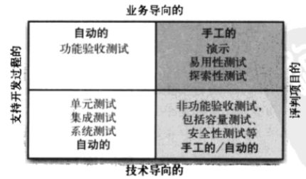

# 测试策略

## 测试四象限

## 微服务测试

* 单元测试（Unit）：mockist vs. classic
* 集成测试（Integration）：datastores and external services
* 组件测试（Component）：in or out of process?
* 契约测试（Contract）：ensuring consistency across boundaries
* 端到端测试（End-to-end）：tips and tricks