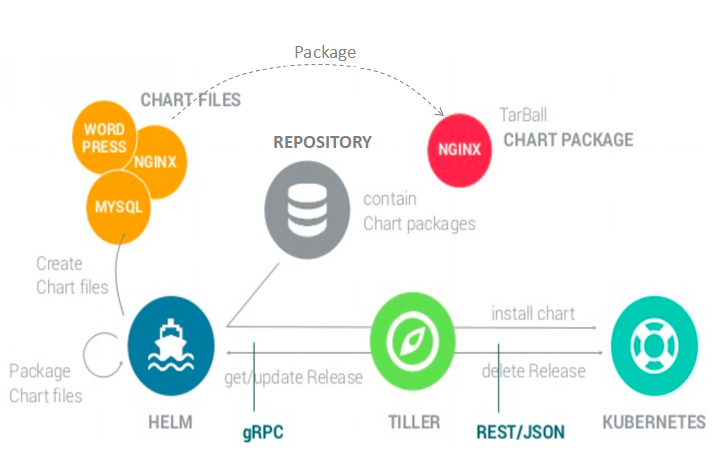

# Helm

> The Kubernetes Package Manager

## 基本概念

* Helm：Kubernetes的应用打包工具，也是命令行工具的名称
* Tiller：Helm的服务端，部署在Kubernetes集群中，用于处理Helm的相关命令
* Chart：Helm的打包格式，内部包含了一组相关的Kubernetes资源
* Repoistory：Helm的软件仓库
* Release：在Kubernetes集群中安装后的Chart称为Release

## 架构



## 安装

```
brew install kubernetes-helm
```

```
$ helm init

$HELM_HOME has been configured at /Users/zhengyunlong/.helm.

Tiller (the Helm server-side component) has been installed into your Kubernetes Cluster.

Please note: by default, Tiller is deployed with an insecure 'allow unauthenticated users' policy.
For more information on securing your installation see: https://docs.helm.sh/using_helm/#securing-your-helm-installation
Happy Helming!
```

```
$ kubectl get pods -n kube-system
NAME                             READY     STATUS    RESTARTS   AGE
tiller-deploy-786d8c8bcd-hrz24   1/1       Running   0          3m
```

## 命令行

```
$ helm search
NAME                            CHART VERSION   APP VERSION     DESCRIPTION
stable/acs-engine-autoscaler    0.1.0                           Scales worker nodes within agent pools
stable/artifactory              5.4.1           5.4.1           Universal Repository Manager supporting all maj...
stable/aws-cluster-autoscaler   0.2.2                           Scales worker nodes within autoscaling groups.
```

```
$ helm inspect stable/mariadb
```

```
$ helm install stable/mariadb
```

```
$ helm ls
NAME                    REVISION        UPDATED                         STATUS          CHART           NAMESPACE
plundering-quokka       1               Wed Jun  6 22:44:18 2018        DEPLOYED        mariadb-0.6.3   default
```

## 自定义Chart

```
$ helm create demo
Creating demo
```

```
$ cd demo
$ tree -l
.
├── Chart.yaml # Chart的基本信息，名称，描述以及版本
├── charts
├── templates
│   ├── NOTES.txt
│   ├── _helpers.tpl
│   ├── deployment.yaml
│   ├── ingress.yaml
│   └── service.yaml
└── values.yaml # 用于存储templates目录中模板文件中用到的变量
```

Chart.yml

```
apiVersion: v1
appVersion: "1.0"
description: A Helm chart for Kubernetes
name: demo
version: 0.1.0
```

验证Chart文件

```
$ helm lint
==> Linting .
[INFO] Chart.yaml: icon is recommended

1 chart(s) linted, no failures
```

打包

```
$ helm package demo --debug
Successfully packaged chart and saved it to: /Users/zhengyunlong/Workspace/yunlzheng/testchart/demo-0.1.0.tgz
[debug] Successfully saved /Users/zhengyunlong/Workspace/yunlzheng/testchart/demo-0.1.0.tgz to /Users/zhengyunlong/.helm/repository/local
```

启动本地服务

```
$ helm serve&
Now serving you on 127.0.0.1:8879
```

添加仓库

```
$ helm repo add local http://127.0.0.1:8879
"local" has been added to your repositories
```

查看仓库

```
$ helm repo list
NAME  	URL
stable	https://kubernetes-charts.storage.googleapis.com
local 	http://127.0.0.1:8879/charts
```

搜索自定义Chart

```
$ helm search demo
NAME      	CHART VERSION	APP VERSION	DESCRIPTION
local/demo	0.1.0        	1.0        	A Helm chart for Kubernetes
```

安装自定义Chart

```
$ helm install local/demo
```

升级版本

```
$ helm ls
NAME                    REVISION        UPDATED                         STATUS          CHART           NAMESPACE
plundering-quokka       1               Wed Jun  6 22:44:18 2018        DEPLOYED        mariadb-0.6.3   default
xrayed-spaniel          1               Wed Jun  6 22:59:49 2018        DEPLOYED        demo-0.1.0      default
```

```
helm search demo -l
NAME            CHART VERSION   APP VERSION     DESCRIPTION
local/demo      0.1.1           1.0             A Helm chart for Kubernetes
local/demo      0.1.0           1.0             A Helm chart for Kubernetes
```

```
$ helm upgrade xrayed-spaniel local/demo 
```

```shell
$ helm list
NAME                    REVISION        UPDATED                         STATUS          CHART           NAMESPACE
plundering-quokka       1               Wed Jun  6 22:44:18 2018        DEPLOYED        mariadb-0.6.3   default
xrayed-spaniel          2               Wed Jun  6 23:01:52 2018        DEPLOYED        demo-0.1.1      default
```

回退版本

```
$ helm history xrayed-spaniel
helm history xrayed-spaniel
REVISION        UPDATED                         STATUS          CHART           DESCRIPTION
1               Wed Jun  6 22:59:49 2018        SUPERSEDED      demo-0.1.0      Install complete
2               Wed Jun  6 23:01:52 2018        DEPLOYED        demo-0.1.1      Upgrade complete
```

```
$ helm rollback xrayed-spaniel 1
Rollback was a success! Happy Helming!
```

## 持续交付

